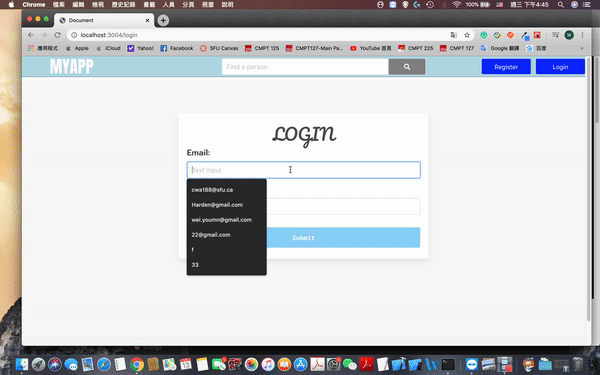
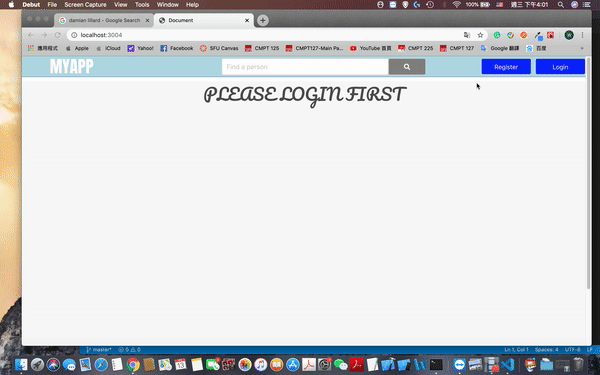
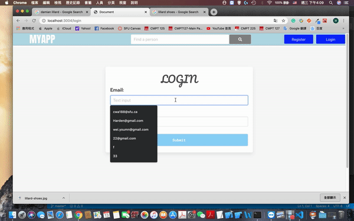
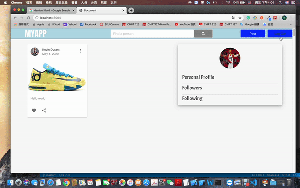
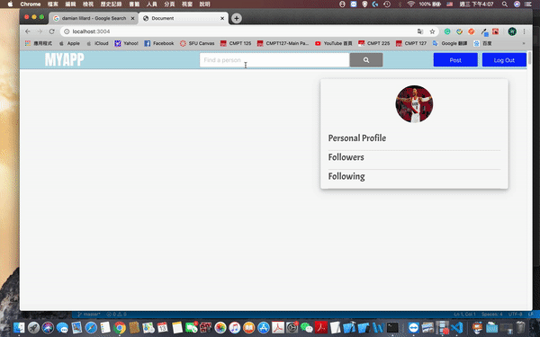
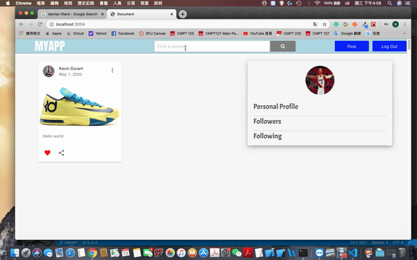

# Socia-media-app
<h1>
  My App's Functions 
</h1>

<h2>
  Overview
 </h2>

  

<h2>
  Register
</h2>

  

<h2>
  Post
 </h2>

  

<h2>
  Like
 </h2>

  

<h2>
  Follow
 </h2>

  

<h2>
  Unfollow
 </h2>

  

